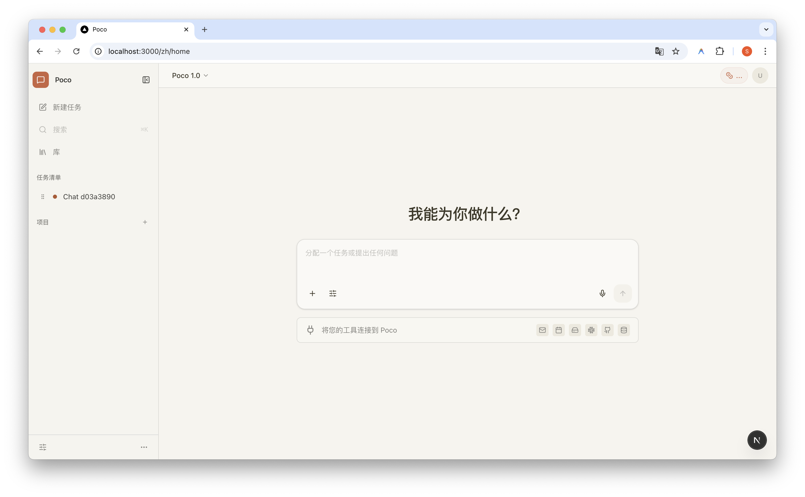
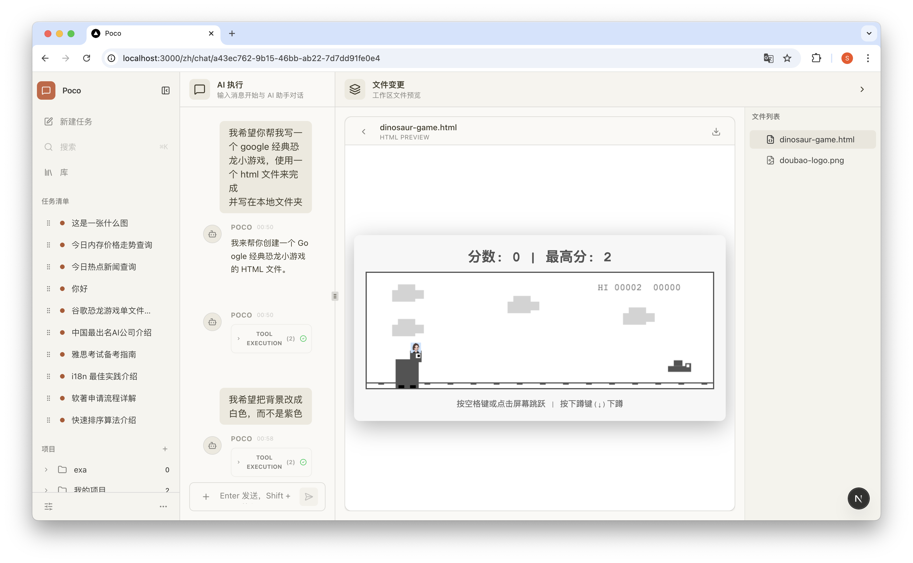
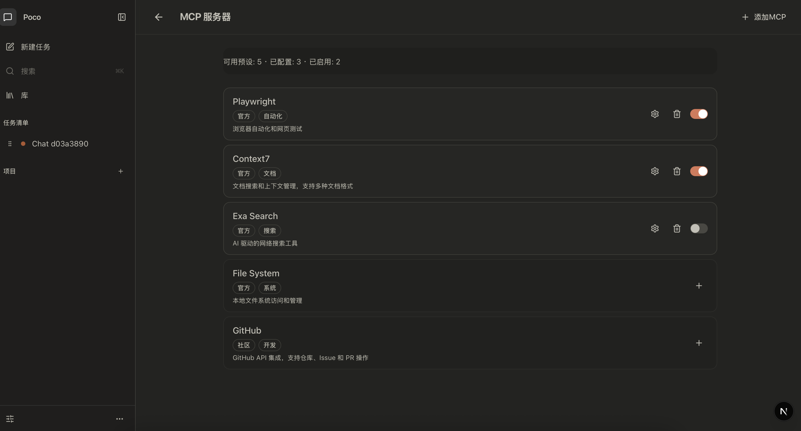

<div align="center">
  

# Poco

**A Cloud-Based AI Agent Execution Platform**

[](https://opensource.org/licenses/MIT)
[](https://www.python.org/downloads/)
[](https://nextjs.org/)
[](https://fastapi.tiangolo.com/)

[English](./README.md) | [中文](./README_zh.md)

</div>

---

### Overview

Poco is a cloud-based AI agent execution platform inspired by Anthropic's [Cowork](https://claude.ai/code). It orchestrates Claude AI agents to perform autonomous tasks beyond coding—organizing files, writing documents, analyzing data, and more—in a distributed cloud environment.



Demo1: use three prompts to build a classic google game with doubao's head 😂

https://github.com/user-attachments/assets/af80fb79-31cb-418d-abbb-694499dc852e


### What is Cowork?

When Anthropic launched Claude Code (an AI coding assistant), they discovered something unexpected: developers weren't just using it to write code. They were using it to organize materials, write documentation, generate reports, analyze data, and even as a "digital colleague" for all kinds of work.

This insight led to **Cowork**, a product that extends Claude's capabilities from "chat assistant" to "digital colleague." Unlike traditional conversational AI that simply responds to prompts, Cowork:

- **Executes tasks autonomously** — Claude plans, executes, and syncs progress continuously
- **Operates on real files** — With user permission, directly access, read, edit, and create files
- **Works in parallel** — Queue multiple tasks without waiting for completion
- **Keeps you in control** — Confirms before any important operations

Poco brings this powerful collaboration paradigm to the cloud, enabling teams to deploy AI agents at scale.


### Key Features

- 🚀 **Autonomous Task Execution** — Agents plan and execute complex tasks independently
- 📁 **Real File Operations** — Direct access to workspace files with permission control
- 🔄 **Parallel Processing** — Queue and execute multiple tasks concurrently
- 🎯 **Progress Tracking** — Real-time status updates and execution monitoring
- 🔌 **Extensible Architecture** — Hook-based plugin system for customization
- 📱 **Mobile Friendly** — Responsive design for mobile devices





### Architecture

Poco consists of four core services working in harmony:

| Service              | Technology           | Purpose                             |
| -------------------- | -------------------- | ----------------------------------- |
| **Frontend**         | Next.js 16, React 19 | Web UI for task management          |
| **Backend**          | FastAPI, SQLAlchemy  | API server & database orchestration |
| **Executor**         | claude-agent-sdk     | Agent execution engine              |
| **Executor Manager** | APScheduler          | Task scheduling & dispatch          |

### Tech Stack

**Frontend:**

- Next.js 16 (App Router)
- React 19
- TypeScript
- Tailwind CSS v4
- shadcn/ui

**Backend Services:**

- Python 3.12+
- FastAPI
- SQLAlchemy 2.0
- PostgreSQL
- APScheduler

### Quick Start

```bash
# Clone the repository
git clone https://github.com/yourusername/poco.git
cd poco

# Install Python dependencies (for each service)
cd backend && uv sync
cd ../executor && uv sync
cd ../executor_manager && uv sync

# Install frontend dependencies
cd frontend && pnpm install

# Start services (each in separate terminal)
# Backend
cd backend && uvicorn app.main:app --reload

# Executor
cd executor && uvicorn app.main:app --reload

# Executor Manager
cd executor_manager && uvicorn app.main:app --reload

# Frontend
cd frontend && pnpm dev
```

### Documentation

For detailed documentation, see [CLAUDE.md](./CLAUDE.md).

### Acknowledgments

Inspired by [Anthropic's Cowork](https://claude.ai/code), an AI-powered collaboration platform for everyone.

---

<div align="center">
  <p>Built with ❤️ by the Poco team</p>
</div>
