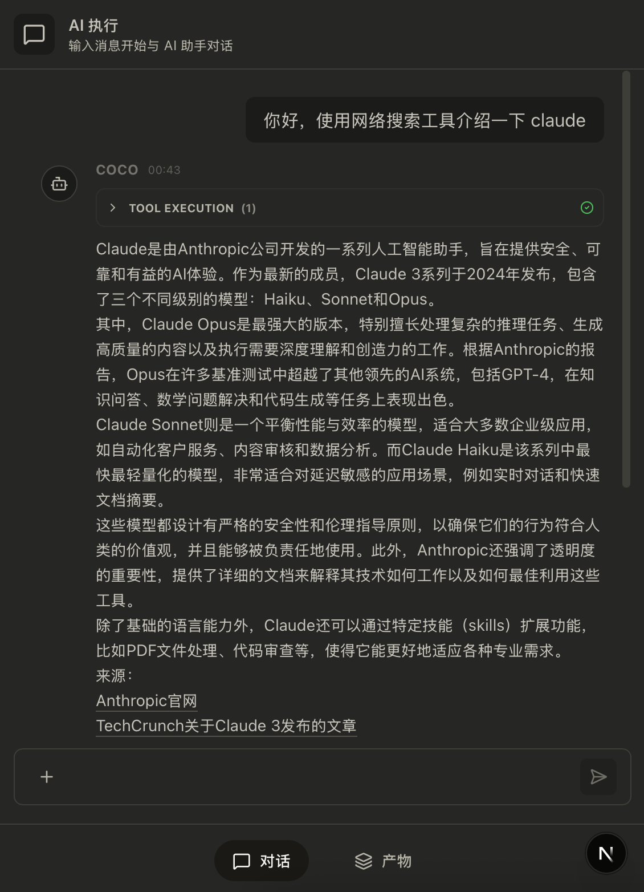

<div align="center">
  

# Poco

**云端 AI 智能体执行平台**

[](https://opensource.org/licenses/MIT)
[](https://www.python.org/downloads/)
[](https://nextjs.org/)
[](https://fastapi.tiangolo.com/)

[English](./README.md) | [中文](./README_zh.md)

</div>

---

## 简介

Poco 是一个云端 AI 智能体执行平台，灵感来自 Anthropic 的 [Cowork](https://claude.ai/code)。它通过编排 Claude AI 智能体，在分布式云环境中自主执行各类任务——从代码编写到文件整理、文档撰写、数据分析等。


## 什么是 Cowork？

当 Anthropic 推出 Claude Code（AI 编程助手）时，他们发现了一个意想不到的现象：开发者们不仅用它来写代码，还用它来整理资料、撰写文档、生成报告、分析数据，甚至将其视为处理各类工作的"数字同事"。

这一洞察催生了 **Cowork**——一款将 Claude 从"聊天助手"升级为"数字同事"的产品。与仅能回复提示的传统对话式 AI 不同，Cowork 具备以下特点：

- **自主执行任务** — Claude 持续规划、执行并同步进度
- **操作真实文件** — 获得授权后，可直接访问、读取、编辑和创建文件
- **并行工作** — 可排队处理多个任务，无需等待完成
- **保持控制权** — 执行重要操作前会先确认

Poco 将这一强大的协作范式带入云端，让团队能够规模化部署 AI 智能体。

## 核心特性

- 🚀 **自主任务执行** — 智能体独立规划和执行复杂任务
- 📁 **真实文件操作** — 在授权控制下直接访问工作空间文件
- 🔄 **并行处理** — 同时排队和执行多个任务
- 🎯 **进度追踪** — 实时状态更新和执行监控
- 🔌 **可扩展架构** — 基于钩子的插件系统，支持自定义
- 📱 **移动友好** — 响应式设计，适配移动设备




## 系统架构

Poco 由四个核心服务协同工作：

| 服务           | 技术                 | 用途                   |
| -------------- | -------------------- | ---------------------- |
| **前端**       | Next.js 16, React 19 | 任务管理 Web 界面      |
| **后端**       | FastAPI, SQLAlchemy  | API 服务器与数据库编排 |
| **执行器**     | claude-agent-sdk     | 智能体执行引擎         |
| **执行管理器** | APScheduler          | 任务调度与分发         |

## 技术栈

**前端：**

- Next.js 16 (App Router)
- React 19
- TypeScript
- Tailwind CSS v4
- shadcn/ui

**后端服务：**

- Python 3.12+
- FastAPI
- SQLAlchemy 2.0
- PostgreSQL
- APScheduler

## 快速开始

```bash
# 克隆仓库
git clone https://github.com/yourusername/poco-agent.git
cd poco-agent

# 安装 Python 依赖（每个服务）
cd backend && uv sync
cd ../executor && uv sync
cd ../executor_manager && uv sync

# 安装前端依赖
cd frontend && pnpm install

# 启动服务（每个服务在独立终端）
# 后端
cd backend && uvicorn app.main:app --reload

# 执行器
cd executor && uvicorn app.main:app --reload

# 执行管理器
cd executor_manager && uvicorn app.main:app --reload

# 前端
cd frontend && pnpm dev
```

## 文档

详细文档请参阅 [CLAUDE.md](./CLAUDE.md)。

## 致谢

灵感来源于 [Anthropic's Cowork](https://claude.ai/code)——面向所有人的 AI 驱动协作平台。

---

<div align="center">
  <p>Built with ❤️ by the Poco team</p>
</div>
